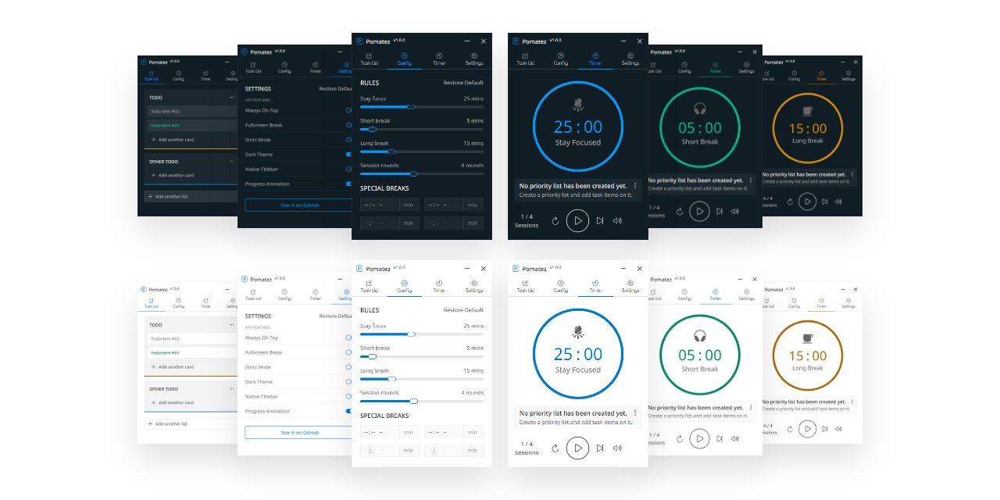

<p align="center">
  <a href="https://roldanjr.github.io/pomatez/">
    
  </a>
</p>

<h1 align="center">Pomatez</h1>

<h3 align="center">Stay Focused. Take a Break.</h3>

<p align="center">
  <br>
  <a href="#sparkles-features">Features</a>
  .
  <a href="#world_map-roadmap">Road Map</a>
  .
  <a href="#rocket-boosters">Boosters</a>
  .
  <a href="#call_me_hand-development">Development</a>
  .
  <a href="#computer-installation">Installation</a>
  .
  <a href="#shield-privacy">Privacy</a>
  .
  <a href="#newspaper-license">License</a>
  <br>
  <br>
</p>

<p align="center">
   <a href="https://snapcraft.io/pomatez">
      <image src="https://snapcraft.io/pomatez/badge.svg" alt="Pomatez" />
   </a>
   <a href="https://travis-ci.com/roldanjr/pomatez">
      <image src="https://travis-ci.com/roldanjr/pomatez.svg?branch=master" alt="Build Status" />
   </a>
   <image src="https://img.shields.io/github/downloads/roldanjr/pomatez/total" alt="Github Downloads" />
   <a href="https://github.com/roldanjr/pomatez/releases/latest">
      <image src="https://img.shields.io/github/v/release/roldanjr/pomatez" alt="Latest Version" />
   </a>
   <a href="https://github.com/roldanjr/pomatez/blob/master/LICENSE">
      <image src="https://img.shields.io/github/license/roldanjr/pomatez" alt="License" />
   </a>
</p>



## :sparkles: Features

- **Customizable rules**. You can easily modify the default rules of Pomodoro Principle to be fitted on your personal needs and likings.

- **Built-in task list**. Allowing you to create task lists that you want to accomplish with drag and drop feature changing your task priorities. It also allow you to mark specific task item as finish or even undo and redu some accident actions.

- **Full-screen breaks**. If enabled, the app will interrupt and force you to take a break by occupying the whole screen while preventing you from working.

- **Desktop notification**. If enabled, you will be notified from time to time. Notification property are divided into 3 types; NONE, NORMAL and EXTRA.

- **Special breaks**. You can set specific time wherein you really need to take a break like for example - lunch, snack, or even dinner time depending on you without having to change the rules that you have been set.

- **Keyboard shortcuts**. Provide some useful keyboard shortcuts allowing you to use the app conveniently.

- **Auto updates**. With this feature, it keeps the app up to date with the latest version. You don't need to download new updates; it delivers directly to your computer.

- **Always on top**. If enabled, the app will always on top of other apps running on your Operating System.

- **Minimize to tray**. If enabled, minimize action will not minimized the app. Instead, it will be hidden and being send to tray. Useful when you want not to be distracted while using the alt-tab on your machine.

- **Close to tray**. If enabled, close action will not quit the app. Instead, it will be hidden and being send to tray. Useful if you don't want to accidentally quit the app.

- **Progress on tray**. It will show progress on your system tray. This feature can be activated if minimize to tray or close to tray feature is enabled.

- **Progress animation**. Allowing you to disable timer progress animation to reduce CPU usage to the app least required.

- **Toggle native titlebar**. Allowing you to switch between default custom titlebar to a native one and vice versa. This feature is useful especially if you don't like the default titlebar.

- **Auto-start work time**. If enabled, the app will automatically start after the timer ends. It is useful when you did not want to always start the timer manually everytime.

- **Voice assistance**. If enabled, desktop notification will have male voice to inform you from time to time. Useful when you are away from your computer while taking some break.

- **Dark theme**. Allowing you to use dark mode helps to reduce your eye strain and improves visibility if you are a type of person with low vision and sensitive to bright light.

- **Strict mode**. If enabled, the app will strictly follow the rules you have set and preventing you from pausing, skipping and resetting the timer when it started.

## :world_map: Roadmap

- **Customizable shortcuts**. Provide a way to make the default keyboard shortcuts customizable by the user.

- **Website Blocker**. Enable user to block specific website while working in order to stay on focus.

- **Productivity report**. Provide some useful summary about user's productivity to have some sense of accomplishments.

- **Time extender**. Enable user to extend timer if needed. Useful when the user wants to finish the task first before taking up a break.

- **Homebrew installer**. Making the app installable via homebrew (cask) makes it easier for some Mac users to install the app on their machine.

- **Tasks database**. Enable user to save completed tasks into a database. Useful when the user wants to monitor or track previews tasks.

## :rocket: Boosters

Find exactly what you need to be more productive and regain control over your time.

Luxafor products already used by **73,859** office workers in productive companies worldwide, such as:

 &nbsp;  &nbsp;  &nbsp;  &nbsp;  &nbsp;  &nbsp;  &nbsp;  &nbsp;  &nbsp;  &nbsp; 

| Name & Description                                                                                                                                                                                                                                                                                                                                                | Image                                                                             |
| ----------------------------------------------------------------------------------------------------------------------------------------------------------------------------------------------------------------------------------------------------------------------------------------------------------------------------------------------------------------- | --------------------------------------------------------------------------------- |
| <h3>[Luxafor Flag](https://luxafor.com/flag-usb-busylight-availability-indicator/?hello=25)</h3> LED availability indicator that eliminates workspace distractions. <br> <a href="https://luxafor.com/flag-usb-busylight-availability-indicator/?hello=25">See details</a>                                                                                        |                        |
| <h3>[Luxafor Bluetooth](https://luxafor.com/bluetooth-busy-light-availability-indicator/?hello=25)</h3> Wireless & software-controlled LED availability indicator that displays notifications and personal availability. <br> <a href="https://luxafor.com/bluetooth-busy-light-availability-indicator/?hello=25">See details</a>                                 |              |
| <h3>[Luxafor Switch](https://luxafor.com/luxafor-switch-meeting-room-availability-indicator-light/?hello=25)</h3> Wireless & remote-controlled availability indicator that displays meeting room and workstation availability in real-time. <br> <a href="https://luxafor.com/luxafor-switch-meeting-room-availability-indicator-light/?hello=25">See details</a> |                    |
| <h3>[Luxafor Cube](https://luxafor.com/luxafor-cube-standalone-do-not-disturb-led-availability-light/?hello=25)</h3> Standalone LED availability indicator that displays meeting room availability. <br> <a href="https://luxafor.com/luxafor-cube-standalone-do-not-disturb-led-availability-light/?hello=25">See details</a>                                    |                        |
| <h3>[Luxafor Pomodoro Timer](https://luxafor.com/luxafor-custom-led-pomodoro-timer/?hello=25)</h3> LED display timer that helps break down work in bite-sized chunks. <br> <a href="https://luxafor.com/luxafor-custom-led-pomodoro-timer/?hello=25">See details</a>                                                                                              |  |
| <h3>[Luxafor ANC Headphones](https://luxafor.com/luxafor-wireless-headphones-with-active-noise-cancelling-technology/?hello=25)</h3> Wireless headphones with active noise cancelling technology. <br> <a href="https://luxafor.com/luxafor-wireless-headphones-with-active-noise-cancelling-technology/?hello=25">See details</a>                                |  |
| <h3>[Office Hero Planner](https://luxafor.com/new-office-hero-planner-2020/?hello=25)</h3> Productivity planner that helps prioritize tasks and measure performance. <br> <a href="https://luxafor.com/new-office-hero-planner-2020/?hello=25">See details</a>                                                                                                    |        |
| <h3>[Don't Break The Chain](https://luxafor.com/dont-break-the-chain-calendar-for-productivity-improvement-development/?hello=25)</h3> A 365-day calendar that keeps you motivated and focused on self-improvement. <br> <a href="https://luxafor.com/dont-break-the-chain-calendar-for-productivity-improvement-development/?hello=25">See details</a>           |  |

## :call_me_hand: Development

This app is built using [React](https://reactjs.org/), [Electron](https://www.electronjs.org/), and [Typescript](https://www.typescriptlang.org/).

It also used [Lerna](https://lerna.js.org/) and [Yarn Workspaces](https://classic.yarnpkg.com/en/docs/workspaces/) for better project management.

### :zap: Quick Setup

1. Install all app dependencies.

   ```sh
   yarn install or npm install
   ```

2. Start the development.

   ```sh
   yarn dev:app or npm run dev:app
   ```

### 🛠 Building for Production

1. Build Windows installer.

   ```sh
   yarn build:win or npm run build:win
   ```

2. Build macOS installer.

   ```sh
   yarn build:mac or npm run build:mac
   ```

3. Build Linux installer.

   ```sh
   yarn build:linux or npm run build:linux
   ```

4. Build macOS, Windows and Linux installer at once.

   ```sh
   yarn build:mwl or npm run build:mwl
   ```

## :computer: Installation

Available for Windows, macOS, and Linux.

Download the latest version from the [Releases Page](https://github.com/roldanjr/pomatez/releases/latest) or from the :point_right: [Download Page](https://roldanjr.github.io/pomatez/) .

> For Linux users. Recommended way to install it is using the Snap Store.

[](https://snapcraft.io/pomatez)

Please consider starring this project to show your :blue_heart: and support.

Thank you friends! :vulcan_salute:

## :shield: Privacy

This app has analytics that will track number of users only ([analytics.ts](https://github.com/roldanjr/pomatez/blob/master/packages/main/src/helpers/analytics.ts)).

## :newspaper: License

MIT © [Roldan Montilla Jr](https://github.com/roldanjr)
