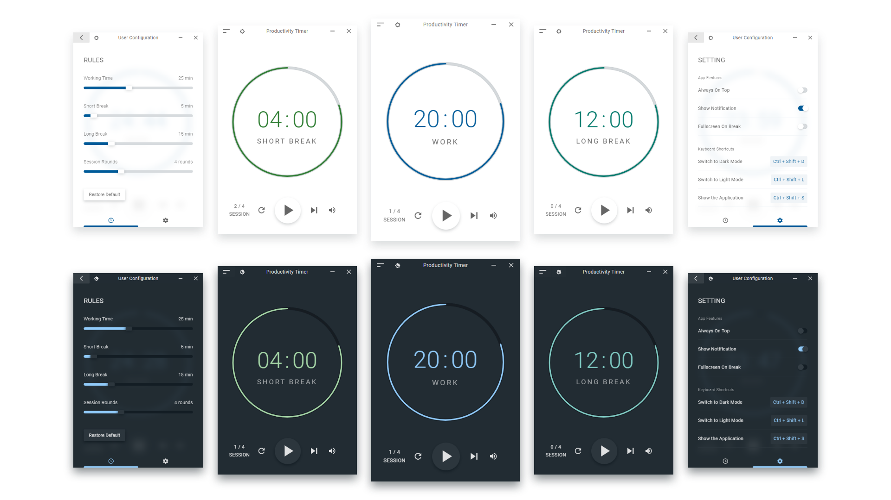

  

<h3 align="center">Productivity Timer</h3>

  Beautiful Time Management App for Productivity inspired by Pomodoro Technique.
    
   
  <a href="#about">About</a>
  .
  <a href="#app-features">App Features</a>
  .
  <a href="#download">Download</a>
   
   

## About

> ### Application Overview

- Productivity Timer wants to help you to be productive and stay in focus.
- It may also helps your eyes to relax if it is experiencing dryness due to too much glare on your screen without a break.
- It was design to help others reducing procastination that leads them to be unproductive.

> ### What is Pomodoro Technique

- Pomodoro Technique is a **time management method** that will improve your focus and productivity. It encourages you to work within the time you have, rather than struggle against it.

- You will finish each day with a sense of accomplishment by doing nothing more than working in 25-minute blocks (called pomodoro sessions), followed by 5-minute breaks.

- Pomodoro Technique is popular with freelancers wanting to track time, students wishing to study more effectively and anyone looking to improve themselves at work or in their personal projects.

[Read more about Pomodoro Technique](https://jawwad.me/book-summary-pomodoro-technique-illustrated-staffan-noteberg/ "Summary of Pomodoro Technique")

> ### How does it work

:memo: 1. Choose task you'd like to get done.

:no_mobile_phones: 2. Focus and minimize distractions.

:alarm_clock: 3. Set the Pomodoro timer to 25 minutes, the standard pomodoro duration.

:computer: 4. Work on the task until the Pomodoro timer rings.

:coffee: 5. Take a short break of 5 minutes, breathe, meditate, grab a cup of coffee, go for a short walk or do something else relaxing (i.e., not work-related). Your brain will thank you later.

:repeat: 6. Repeat the cycle and every 4 pomodoros, take a longer break of 15 minutes or more.

## App Features

> **Note** : Some of these features are optional. You may disable or enable it.

> As of now all of this features are based on the likes, needs and personal preference of the owner.

> Feel free to make feedbacks of what feature/s of the app do you liked the most and didn't. Also since it is on it's early stage, contributions are welcome and very much appreciated!

- **Alway On Top**

  If enabled, the app will always on top all application running on your desktop. It is usefull when you want to consicutively track your time but sometimes destructive for other people.

- **Show Notification**

  If enabled, it will show desktop notification on every _Work Finished_, _Short Break Finished_ and on _Long Break Finished_.

- **Fullscreen On Break**

  If enabled, on every _SHORT BREAK_ and _LONG BREAK_, the app will automatically fullscreen and you cannot escape from taking your break.

- **Toggle UI Theme**

  By `default`, the app will choose what theme if for you depending on your **Operating System Color Theme** when you first installed it on your machine.
  You can toggle it after whether you prefered _DARK MODE_ or _LIGHT MODE_.

- **Keyboard Shortcuts**

  Some of important are being enabled due to it's usefulness.

  > List of available Shortcut Keys

  | Command              | Keybinding            |
  | -------------------- | --------------------- |
  | Switch to Dark Mode  | CmdOrCtrl + Shift + D |
  | Switch to Light Mode | CmdOrCtrl + Shift + L |
  | Show the Application | CmdOrCtrl + Shift + S |

* **Text To Speech**

  If _Show Notification_ is enabled. This feature will automatically activated.

  > What it does?

  It will speak on every _Work Finished_, _Short Break Finished_ and on _Long Break Finished_ to inform what you should do next.

- **Silent Mode**

  You can optionally mute the sound on every notification and it will also disable _Text To Speech_ from speaking.

- **Run On Background**

  This feature is very useful. You can close the application and let it run in the background if you want to be not distructed when you toggle between applications you opened.

  > Benefits

  - It will not destruct you on your task.
  - It will decrease CPU usage by approximately 99% to 100% while it still running and doing its task.
  - It task completed, the app automatically shows if it's not visible to inform you that the task is completed.

- **Auto Updates**

  The app wil automatically `Check for Updates` and notify you if there's an available updates.

  It will automatically download the updates so it won't bother you from downloading new and better version of the app.

### **Future Plans**

- **Built In Notes Feature**

  This feature let you write down notes or any checklist you want to accomplish at the end of the day so you won't need to use other _TODO app_ taking notes of what are those task you want to do.

- **Eyes Breaker Option on Every Break**

  On every _SHORT BREAK_ and _LONG BREAK_, you will be given an option to do exercise your eyes using the **Eyes Breaker** feature of the app.

  It will help you especially if you are suffering from tiredness of the eyes due to long exposure to you computer.

## Download

> **Note** : This is currently available on Windows PC.

In the near future. I will produce installers to those non Window user.

Download the latest version from the [Releases Page](https://github.com/roldanjrCodeArts9711/productivity-timer/releases).
