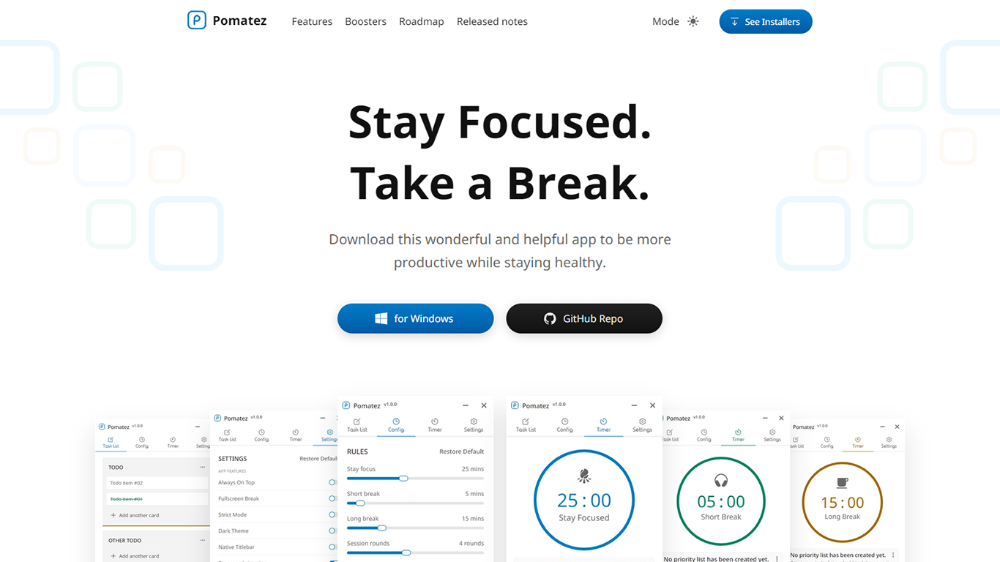
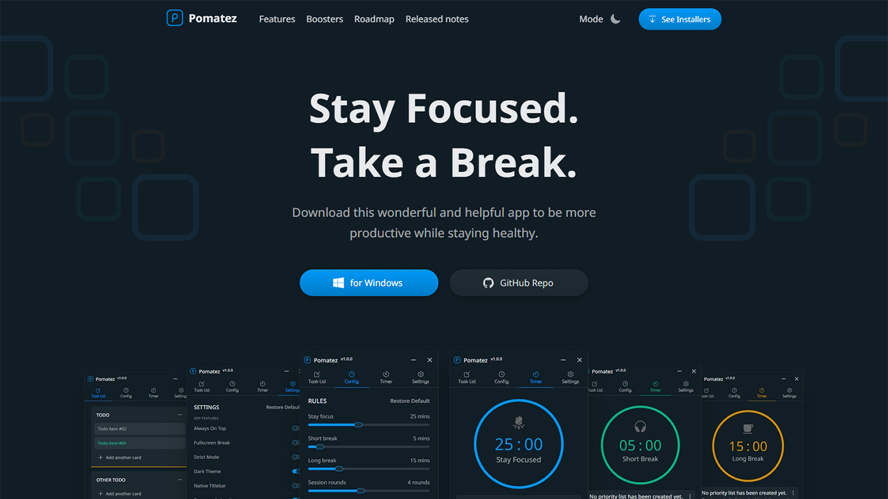

# Pomatez website





## 🛠 Installation & Set Up

1. Install the Gatsby CLI

   ```sh
   npm install -g gatsby-cli
   ```

2. Install and use the correct version of Node using [NVM](https://github.com/nvm-sh/nvm)

   ```sh
   nvm install
   ```

3. Install dependencies

   ```sh
   yarn install or npm install
   ```

4. Start the development server

   ```sh
   yarn dev or npm run dev
   ```

## 🚀 Building and Running for Production

1. Generate a full static production build

   ```sh
   yarn build or npm run build
   ```

1. Preview the site as it will appear once deployed

   ```sh
   yarn serve or npm run serve
   ```

## License

MIT © [Roldan Montilla Jr](https://github.com/roldanjr)
